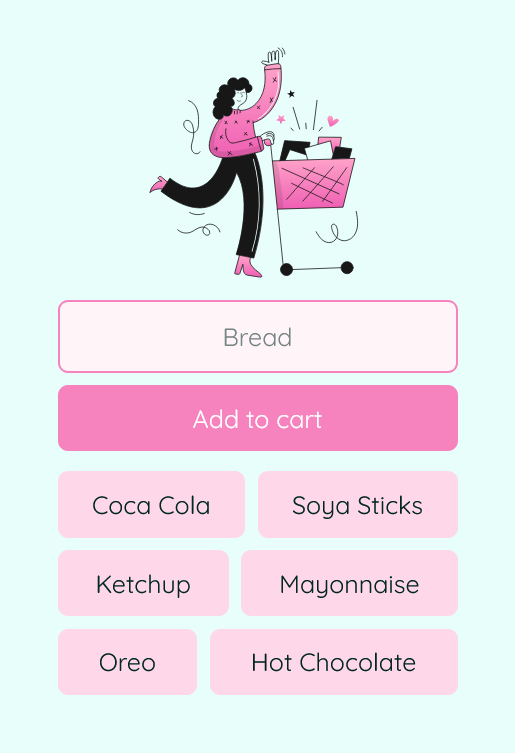

# Cartizee

Cartizee is a simple shopping cart application built using Firebase as its database. It is a Progressive Web App (PWA) that allows users to add items to their cart. Just a simple click on the item will remove it from the cart. The cart is persistent, meaning that the items will remain in the cart even after the user closes the app.

### Screenshot

### Link

- Live Site URL: [Netlify](https://cartizee.netlify.app)

### Built with

- HTML
- CSS
- JavaScript
- Firebase
